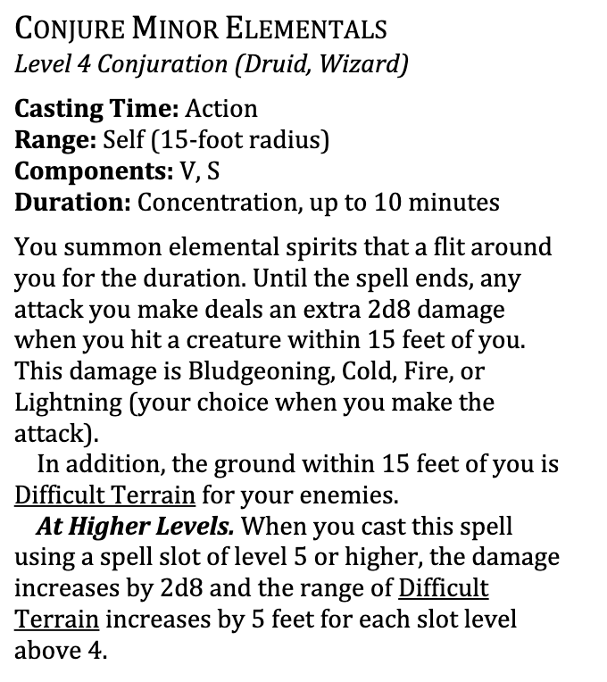
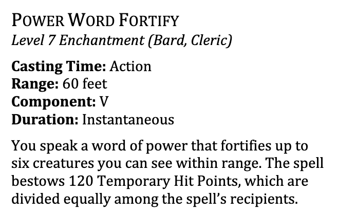

Document listing all changes in a short form for upgrading from 5e to oneDND

## Classess
### Barbarian
#### Rage
* You now regain one expended rage when you finish a short rest
#### Brutal Strike
* 9th level feature
* Brutal Strike, new feature that lets you trade advantage granted by reckless attack for tactical options
* Gain 1d10 extra damage when you brutal strike and gain one of the following features
    * push 15 feet awa and move half your speed towards target w/out opportunity attacks
    * Reduce target's speed by 15 until start of your next turn.
    * [13th level] target has disadvantage on next saving throw and can't make opportunity attacks until the start of your next turn
    * [13th level] next attack roll made against the creature gains bonus to their attack roll equal to your rage damage
    * [17th level] damage becomes 2d10 from 1d10
    * [17th level] you can use 2 options when you brutal strike, not just 1
#### Persistent Rage
* 15th level feature
* Now restores all uses of your rage onece per long rest,
* The unconcious condition not the incapacitated condition shuts off rage

### Druid
#### Wildshape
* has a number of known beast forms (2 + half druid level rounded up)
* Beast form no longer retains druid's species traits
* wildshape gives temp hp instead of new Hp pool, temp hp total = your druid level
* regain one use when you finish a short rest

### Monk
#### Martial Arts
* Scales from d6 to d12 instead of d4 to d10

#### Bonus Unarmed Strike
* No longer tied to attack action

#### Dexterous Attacks
* Can use DEX instead of STR when using grapple and push options of unarmed strikes

#### Monk's Discipline
* essentially replaces ki points (discipline == ki)

#### Flurry of Blows
* Can spend 1 discipline point to make 2 unarmed strikes... no longer tied to attack action
* [10th level] you can make 3 unarmed strikes instead of just 2

#### Patient Defense
* disengage as bonus action, no ki point cost, or spend 1 ki point to disengage and dodge, used to be 1 kit to just dodge
* [10th level] when you patient defense, gain temp HP = 2 * martial arts die

#### Step of the Wind
* Dash as a bonus action, no cost... or spend 1 discipline to take disengage as dash as bonus action, and jump distance doubled for the turn.  
* Used to be 1 discipline to dash OR disengage w/ double jump distance
* [10th level] choose a willing large or smaller creature within 5 feet, you can move that creature with you until end of your turn, and they don't provoke opportunity attacks.

#### Uncanny Metabolism
* new level 2 ability
* 1/long rest, when you roll initiative, regain all discipline points, and gain HP = to roll of martial arts die + monk level

#### Deflect Attacks
* Used to be Deflect missles
* now works agaisnt all B/P/S attacks, not just ranged attacks.
* attack is reduce dby 1d10 + Dex mod + monk level (used to not include dex mod in damage reduction calculation)

#### Stunning Strike
* is now a 1/turn feature
* When a target succeeds on the saving throw, they take force damage equal to a roll of martials arts die + wis modifier

#### Empowered Strikes
* replaces ki-empowered strikes
* you can choose to do force damage with your attacks, no longer have "magical" hands, speculations belive there will be no magical vs non-magical b/p/s

#### Self-Restoration
* 10th level ability, used to be 7th level Stillness of mind
* Old ability was action to remove charm or frighten
* new ability is at the end of your turn, you can choose to end one charm, frighten, or poison condition affecting you, no save, no action

#### Deflect Energy
* 13th level ability
* deflect attacks ability now also works against any damage type, not just b/p/s

#### Discplined Survivor
* Used to be called Diamond Soul (personally I liked the old name better)

#### Perfect Discipline
* 15th level
* used to be 20th level ability, perfect self
* when you have less than 4 discipline and roll iniative, you regain expended discipline until you have 4

#### Superior Defense
* Used to be called empty body (18th level)
* No action required, 3 discipline to gain resistance to all damage except force
* Used to be action, spend 4 ki to become invisible for 1 minute
* additionally used to allow for 8 ki to cast astral projection spell on self only w/out material components

#### Body and Mind
* new 20th level feature
* gain +4 to dex and wisdom scores, increasing max for those scores to 26

## Spells

### Conjure Animals
* Completely Redesigned
TODO: Combine these images together from
https://media.dndbeyond.com/compendium-images/ua/ph-playtest8/gHvtmY50loGLgQUb/UA2023-PH-Playtest-8.pdf?icid_source=house-ads&icid_medium=crosspromo&icid_campaign=playtest9

### Conjure Celestial
* Completely redesigned

### Conjure Elemental
* Completely Redesigned

### Conjure Fey
TODO Combine these images

### Conjure Minor Elementals
* Completely Redesigned

### Conjure Woodland Beings
* Completely Redesigned

### Cure Wounds
* healing is now 2d8 at level 1, and 2d8 per level upcast, used to be 1d8 and 1d8 per level upcast

### Fount of Moonlight
* New 4th level spell for bards and druids

### Healing Word
* 2d4 at level 1, and 2d4 per level upcast, used to be 1d4 and 1d4 per level upcast

### Mass Cure Wounds
* now restores 5d8 instead of 3d8

### Mass Healing Word
* heals 2d4 instead of 1d4

### Power Word Fortify
* new spell for bards and clerics

### Starry Wisp
* New cantrip for bards and druids
* scales 2d8 at level 5, 3d8 at 11th, and 4d8 and 17th

## New Rules
### Feats
#### Ability Score Improvement
* Is now a feat, you don't choose between ASI or Feat, you always get a feat at 4/8/12/16/19th level, but one option for a feat is an ASI
* Same as before, BUT at 19th level you can increase your abilty score to a max of 22 not just 20

### Weapon Masteries
* All weapons now have mastery properties
TODO: ADD TABLE HERE OR CLEANED UP IMAGE

#### Heavy Weapon Property
A Heavy weapon is unwieldy compared to other
weapons. You have Disadvantage on your attack
rolls with a Heavy weapon if it’s a Melee weapon
and your Strength score isn’t at least 13, and if
it’s a Ranged weapon and your Dexterity score
isn’t at least 13.

#### Light Weapon Property
When you take the Attack action on your turn
and attack with a Light weapon, you can make
one extra attack as a Bonus Action later on the
same turn. That extra attack must be made with
a different Light weapon, and you don’t add your
ability modifier to the extra attack’s damage,
unless that modifier is negative.
For example, if you take the Attack action on
your turn and have a Shortsword in one hand
and a Dagger in the other—each of which has the
Light property—you can make one attack with
each weapon using your action and a Bonus
Action, but you don’t add your Strength or
Dexterity modifier to the damage roll of the
Bonus Action unless that modifier is negative.

#### Thrown Weapon Property
If a weapon has the Thrown property, you can
throw the weapon to make a ranged attack, and
you can draw that weapon as part of the attack.
If the weapon is a Melee weapon, use the same
ability modifier for that attack roll and damage
roll that you would use for a melee attack with
the weapon. For example, if you throw a
Handaxe, you use your Strength, but if you throw
a Dagger, you can use either your Strength or
your Dexterity since the Dagger has the Finesse
property.

#### Cleave Mastery Property
*Prereq: Heavy melee weapon*
If you hit a creature with a melee attack using
this weapon, you can make an attack roll with
the weapon against a second creature within 5
feet of the first that is also within your reach. On
a hit, the second creature takes the weapon’s
damage, but don’t add your ability modifier to
that damage unless that modifier is negative. You
can make this extra attack only once per turn.

#### Graze Mastery Property
*Prereq: Heavy melee weapon*
If your attack roll with this weapon misses a
creature, you can deal damage to that creature
equal to the ability modifier you used to make
the attack roll. This damage is the same type
dealt by the weapon, and the damage can’t be
increased in any way, other than increasing the
ability modifier.

#### Nick Mastery Property
*Prereq: light weapon*
When you make the extra attack of the Light
property, you can make it as part of the Attack
action instead of as a Bonus Action. You can
make this extra attack only once per turn.

#### Push Mastery Property
*Prerequisite: Heavy, Two-Handed, or Versatile Property*
If you hit a creature with this weapon, you can
push the creature up to 10 feet straight away
from yourself if it is Large or smaller.

#### Sap Mastery Property
*Prerequisite: Versatile Property or No Weapon Property*
If you hit a creature with this weapon, that
creature has Disadvantage on its next attack roll
before the start of your next turn.

#### Slow Mastery Property
*Prerequisite: None*
If you hit a creature with this weapon and deal
damage to the creature, you can reduce its Speed
by 10 feet until the start of your next turn. If you
hit the creature more than once with this
property, the Speed reduction doesn’t exceed 10
feet.

#### Topple Mastery Property
*Prerequisite: Heavy, Reach, or Versatile Property*
If you hit a creature with this weapon, you can
force the creature to make a Constitution saving
throw with a DC equal to 8 + your Proficiency
Bonus + the ability modifier used to make the
attack roll. On a failed save, the creature has the
Prone condition.

#### Vex Mastery Property
*Prerequisite: Ammunition, Finesse, or Light Property8
If you hit a creature with this weapon and deal
damage to the creature, you have Advantage on
your next attack roll against that creature before
the end of your next turn.

## Rules Glossary
TODO add rules that have changed...

